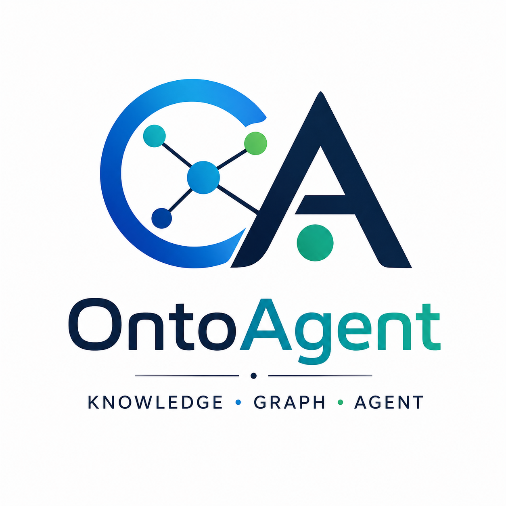
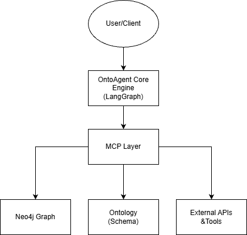

  

<h1 align="center">OntoAgent</h1>

  <strong>A Knowledge-Driven, Ontology-Powered Agent Framework</strong>

  
  
  
  

  Build next-generation AI agents powered by Ontology reasoning, 
  Knowledge Graphs, and the MCP (Model Context Protocol) tool ecosystem.

---

## 🌟 Why OntoAgent?

Traditional LLM agents often struggle with unresolvable hallucinations and untraceable tool calls. **OntoAgent** bridges LLMs with structured domain knowledge, introducing an **Ontology-Driven Reasoning Layer**.

User ──> Agent ──> Ontology (Schema) ──> Knowledge Graph ──> Reasoning ──> Tool Execution

- **Explainable Reasoning:** Every tool invocation and decision is grounded by ontological constraints.
- **Structured Knowledge Management:** Native alignment with Graph databases (Neo4j) for deep semantic memory.
- **Scalable Workflows:** Flexible orchestration driven by state-of-the-art graph routing.

---

## 🏗️ Architecture

OntoAgent adopts a layered architecture separating core reasoning, state workflows, and tool communication protocol.

---

## 🚀 Features

Core Capabilities

✅ LangGraph Workflow: Complex multi-step routing, loops, and precise agent state management.

✅ MCP Integration: Native Model Context Protocol support to seamlessly connect with hundreds of standard tools.

✅ Neo4j Knowledge Graph: Production-ready Cypher generation and graph-based retrieval augmented generation (GraphRAG).

✅ Ontology Support: Structural constraints definitions ensuring the agent reasons within deterministic boundaries.

✅ FastAPI Service: Out-of-the-box RESTful APIs and WebSocket endpoints for production integration.

Roadmap / In Progress

🚧 Evaluation Harness: Automated frameworks for benchmarking graph reasoning accuracy.

🚧 Docker Deployment: One-click multi-container deployment orchestration.

🚧 Multi-Agent Support: Multi-agent collaboration protocols governed by shared ontologies.

---

## 🛠️ Quick Start

Prerequisites

- Python 3.12+

- Neo4j Database instance (Local or AuraDB)

Installation & Setup

- 1.Clone the repository

  git clone [https://github.com/your-username/OntoAgent.git](https://github.com/your-username/OntoAgent.git)
  cd OntoAgent

- 2.Configure Environment Variables
  cp .env.example .env

  Edit .env and configure your LLM, Neo4j credentials, and MCP endpoints.

- 3.Spin up Infrastructure (Optional)
  docker compose up -d

- 4.Run the Application
  python run.py

---

## 📺 Live Demo & Capabilities

Case Study: Semantic E-Commerce Query

Question: "Find all products purchased by a customer named Alice and explain their semantic connections."

How OntoAgent Processed the Request:

- 1.Ontology Alignment: Maps "customer" and "products" to domain classes.

- 2.KG Querying: Automatically generates optimized Cypher statements for Neo4j.

- 3.MCP Tool Execution: Fetches real-time stock levels for those products via external APIs.

---

## 📖 Documentation Directory

Explore our detailed design specs and ecosystem strategy:

🏛️ Architecture Overview

- [Model Context Protocol (MCP) Integration](https://www.google.com/search?q=./docs/architecture/mcp.md)

- [Agent Core API Specs](https://www.google.com/search?q=./docs/architecture/agent-api.md)

- [Web Application Integration](https://www.google.com/search?q=./docs/architecture/web-integration.md)

🌐 Ecosystem & Strategy

- [Agent-to-Agent (A2A) Protocols](https://www.google.com/search?q=./docs/ecosystem/a2a.md)

- [Platform & Scalability Strategy](https://www.google.com/search?q=./docs/ecosystem/platform-strategy.md)

- [The Agent Economy Blueprint](https://www.google.com/search?q=./docs/ecosystem/agent-economy.md)
