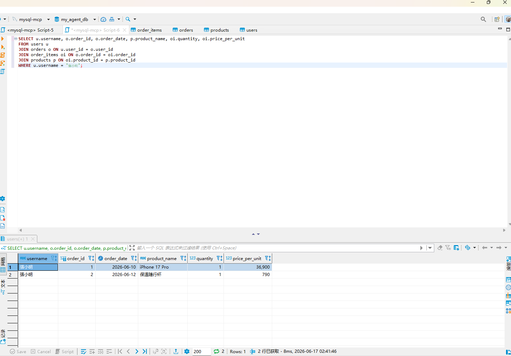
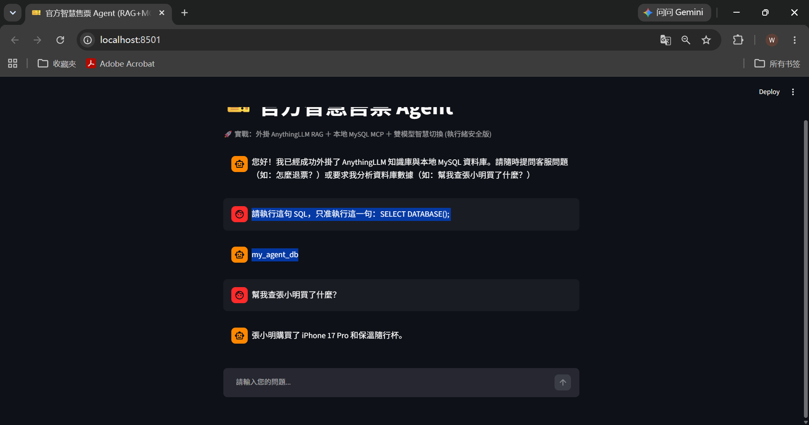
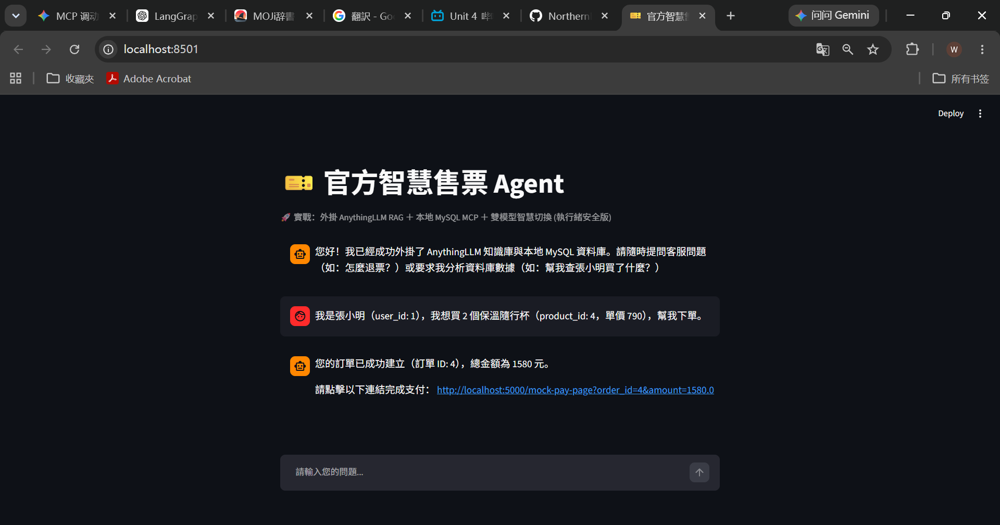
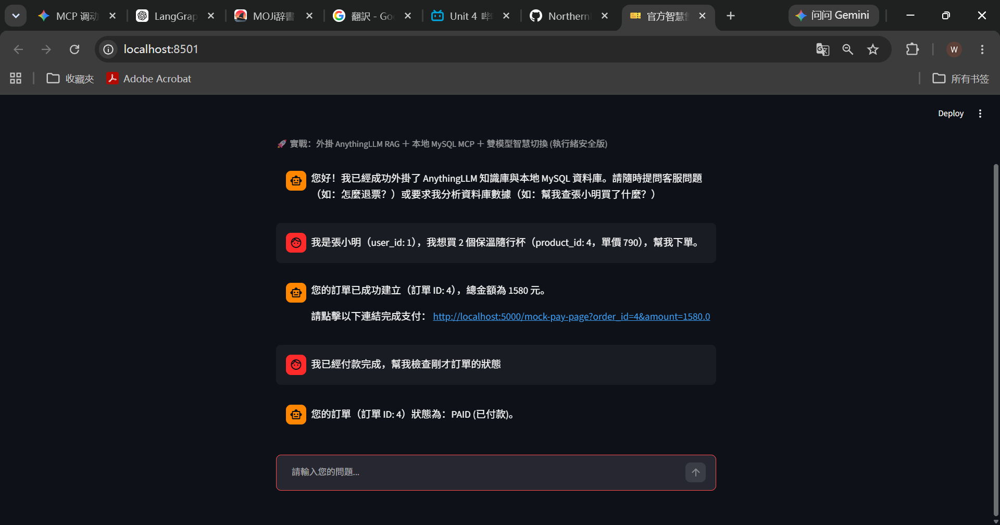
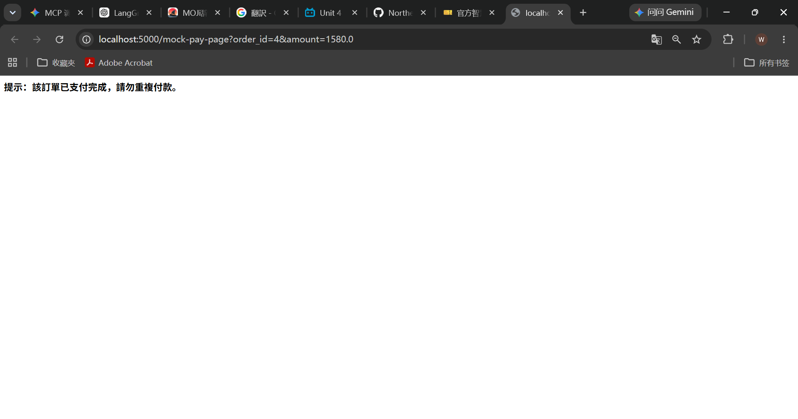

  

<h1 align="center">OntoAgent</h1>

Knowledge-Driven Agent Framework

Build AI Agents with:

\- LangGraph Workflow
\- MCP Tool Ecosystem
\- Knowledge Graph (Neo4j)
\- Ontology-based Reasoning
\- Agent Evaluation Harness

\---

\## Why OntoAgent?

User
↓
Agent
↓
Ontology
↓
Knowledge Graph
↓
Reasoning
↓
Tool

making agents more explainable, structured and scalable.

## architecture

┌─────────────┐
│ User                                    │
└──────┬──────┘
       │
┌──────▼──────┐
│ OntoAgent                       │
│ (LangGraph) │
└──────┬──────┘
       │
 ┌─────┴─────┐
 │ MCP Layer │
 └─────┬─────┘
       │
 ┌─────┼─────┐
 │     │     │
 ▼     ▼     ▼

Neo4j  Ontology  External APIs
Graph                     / Tools

## features

✅ LangGraph Workflow

✅ MCP Integration

✅ Neo4j Knowledge Graph

✅ Ontology Support

✅ FastAPI Service

🚧 Evaluation Harness

🚧 Docker Deployment

🚧 Multi-Agent Support

Quick Start

git clone ...

cp .env.example .env

docker compose up

python run.py

##Demo

Question:

Find all products purchased by a customer.

Answer:

...

##Documentation

docs/

architecture/
├── mcp.md
├── agent-api.md
├── web-integration.md

ecosystem/
├── a2a.md
├── platform-strategy.md
├── agent-economy.md
